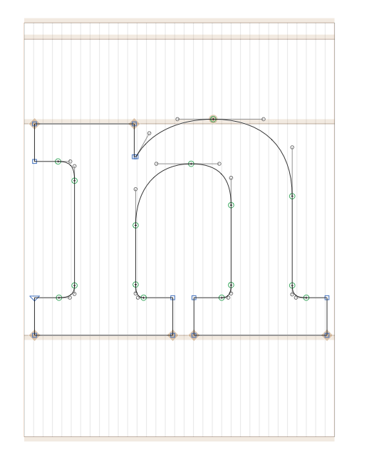

# Unitizer Plugin for Glyphs

This is a plugin for the [Glyphs font editor](http://glyphsapp.com/). After installation, it will add the menu item *View > Show Unitizer*.

It's helpful for working in Unitized fonts. It display *unit guidelines* in the background (correspondong to a value that you can configure at will) of the current glyph in Edit view (as seen in Ikarus and DTL

### Unitized fonts?

Through history, type designers have used many different unit systems, for many different reasons.

For example:
- 1 unit, for Monospaced fonts
- 11 & 12 units, used by the IBM Executive Typewriter
- 18 units, used by Monotype
- 36 units, used by Lumitype
- 48 units, used by Berthold
- 54 units, used by many Photo-typesetting and later Linotype
- 96 units, used by Later Monotype

In the age of digital font-editors we can use a 1000 units system. We have extreme liberty! but sometimes it's useful to put some constraints to ourselves and adopt a more restrained scheme.
Whatever the unit system you want to work with, using this macro all you have to do is define the size of your unit and set a custom parameter in the master info, and you will get handy guidellines that will make your life easier.

**If you want to learn more:**
1. Read Frank E. Blokland’s [research on unitization](http://www.lettermodel.org/)
2. Watch Matthew Carter's [comments on unitization](https://vimeo.com/39071550#t=954s)

### Installation

1. Download the complete ZIP file and unpack it, or clone the repository.
2. Double click the .glyphsReporter file. Confirm the dialog that appears in Glyphs.
3. Restart Glyphs

### Usage Instructions

1. In *Font Info > Masters* add a custom parameter named **unitizerUnit** and set a value of your preference. (*10*, *12*, *20* or whatever value you want **your unit** to be).
2. Open a glyph in Edit View.
3. Use *View > Show Unitizer* to toggle the display of guidelines, according to your *unitizerUnit* custom parameter value.
4. If the advance width of your current glyph does not fit in your unit scheme, the difference will be shown in red.

### Requirements

The plugin works in the latest version of Glyphs.

### License

Copyright 2016 Pablo Impallar (@impallari).
Based on sample code by Rainer Erich Scheichelbauer (@mekkablue).

Licensed under the Apache License, Version 2.0 (the "License");
you may not use this file except in compliance with the License.
You may obtain a copy of the License at

http://www.apache.org/licenses/LICENSE-2.0

See the License file included in this repository for further details.